<!-- README.md is generated from README.Rmd. Please edit that file -->

# plutor

<!-- badges: start -->

[](https://app.codecov.io/gh/william-swl/plutor?branch=master)
[](https://github.com/william-swl/plutor/actions/workflows/check-standard.yaml)
[](https://github.com/william-swl/baizer)
<!-- badges: end -->

- In ancient Roman mythology, `Pluto` was the ruler of the underworld
  and presides over the afterlife.

- `Pluto` was frequently conflated with `Plutus`, the god of wealth,
  because mineral wealth was found underground.

- When plotting with R, you try once, twice, practice again and again,
  and finally you get a pretty figure you want.

- It’s a `plot tour`, a tour about repetition and reward.

- Hope `plutor` helps you on the tour!

## installation

You can install the development version of `plutor` like so:

``` r
devtools::install_github("william-swl/plutor")
```

And load the package:

``` r
library(plutor)
```

It is recommended to perform initialization, which adjusts the default
plotting parameters in an interactive environment (such as jupyter
notebook) and sets the default theme to `theme_pl()`.

``` r
pl_init()
```

## plots

Description values plot:

- The describe geom is used to create description values plot, including
  center symbol and error symbol.

- The center symbol can be mean, median or other custom functions.

- The error symbol can be sd, quantile or other custom functions.

``` r
mini_diamond %>% ggplot(aes(x = cut, y = price)) +
  geom_point() +
  geom_describe()
```

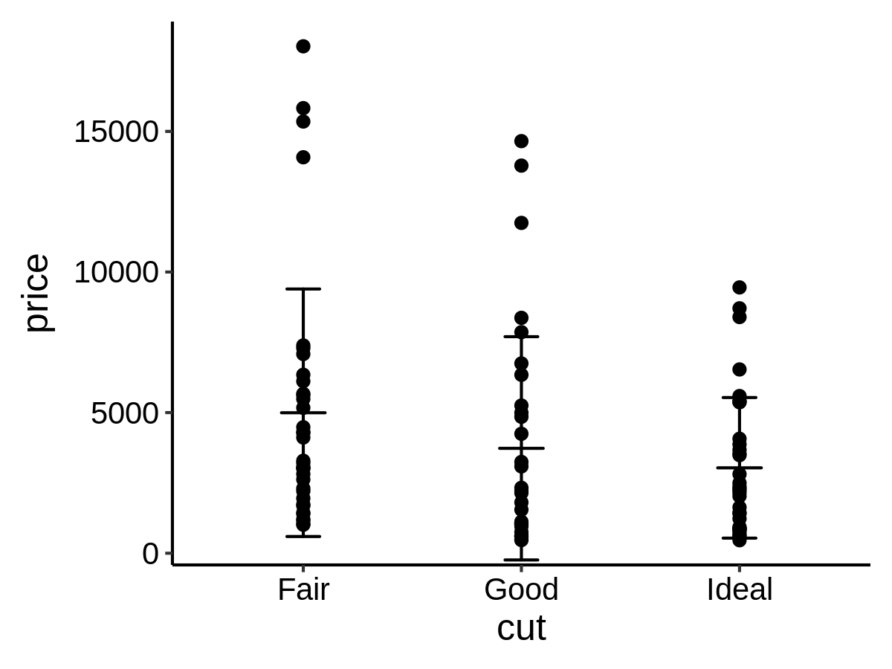

``` r
center_func <- median
low_func <- function(x, na.rm) {
  quantile(x, 0.25, na.rm = na.rm)
}

high_func <- function(x, na.rm) {
  quantile(x, 0.75, na.rm = na.rm)
}

mini_diamond %>% ggplot(aes(x = cut, y = price)) +
  geom_point() +
  geom_describe(center_func = center_func, low_func = low_func, high_func = high_func)
```

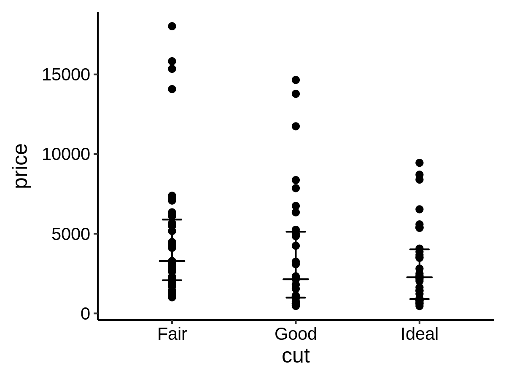

Add p value and fold change on a plot

``` r
p <- ggplot(data = mini_diamond, mapping = aes(x = cut, y = price)) +
  geom_point() +
  geom_compare(cp_label = c("psymbol", "right_deno_fc"), lab_pos = 25000, step_increase = 0.3) +
  ylim(0, 40000)
p
```

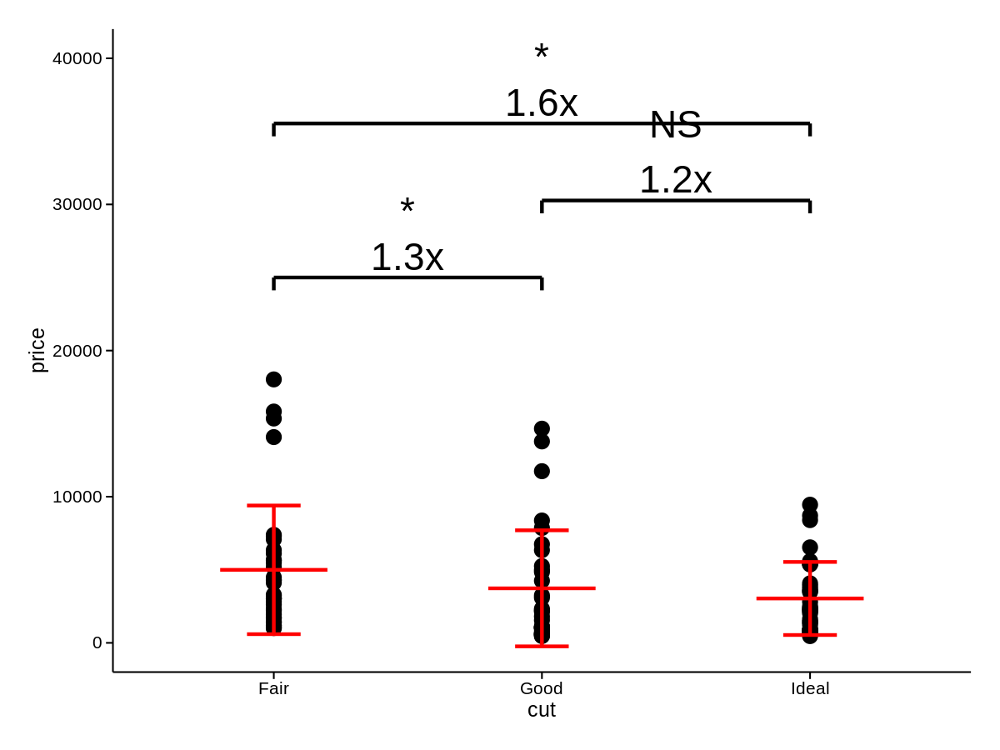

``` r
ggplot(data = mini_diamond, mapping = aes(x = cut, y = price)) +
  geom_point() +
  geom_compare(cp_ref = "Good", cp_inline = TRUE, lab_pos = 22000, brackets_widen = 0.1) +
  geom_compare(cp_ref = "Ideal", cp_inline = TRUE, lab_pos = 25000, brackets_widen = 0.1) +
  ylim(0, 40000)
```

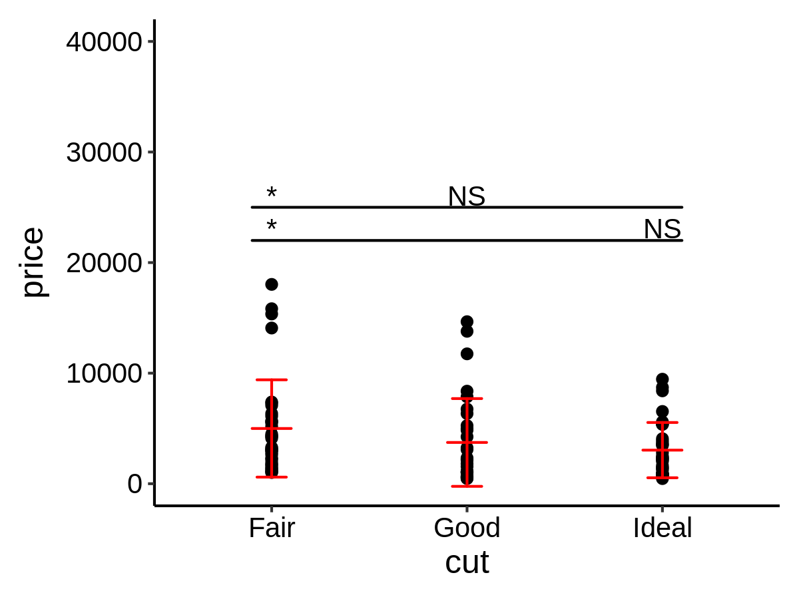

extract the result of `geom_compare` from a `ggplot` object

``` r
head(extract_compare(p))
#>   PANEL x xend n1 n2     p plim psymbol       y1       y2       fc
#> 1     1 1    2 35 31 0.041 0.05       * 4995.057 3730.387 1.339018
#> 2     1 2    3 31 34  0.93 1.01      NS 3730.387 3036.588 1.228480
#> 3     1 1    3 35 34 0.018 0.05       * 4995.057 3036.588 1.644957
#>   right_deno_fc left_deno_fc    label cp_step       y    yend group
#> 1          1.3x        0.75x  *\n1.3x       0 25000.0 25000.0     1
#> 2          1.2x        0.81x NS\n1.2x       1 30269.2 30269.2     1
#> 3          1.6x        0.61x  *\n1.6x       2 35538.4 35538.4     1
```

A new `Stat` class to add mean labels on a plot

``` r
mini_diamond %>% ggplot(aes(x = cut, y = price)) +
  geom_point() +
  geom_text(aes(label = price), stat = "meanPL")
```

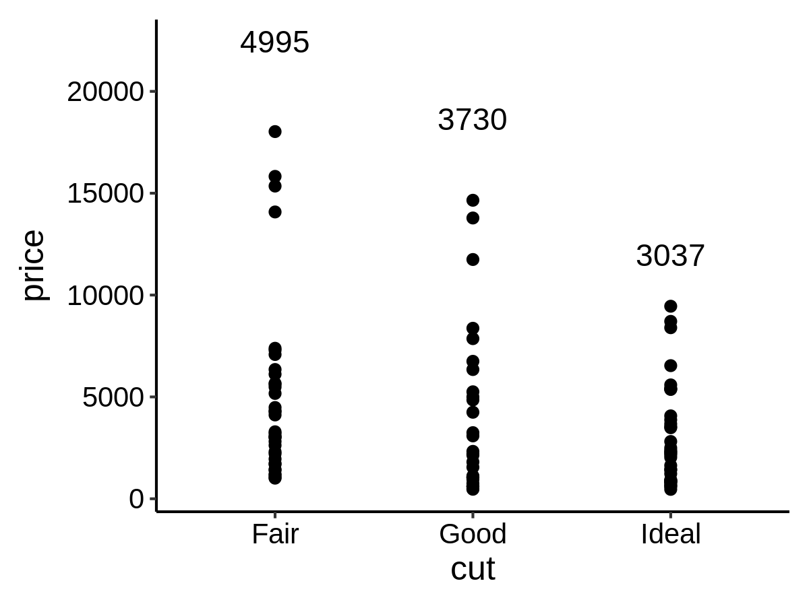

A new `Stat` class to add count labels on a plot

``` r
mini_diamond %>% ggplot(aes(x = cut, y = price)) +
  geom_point() +
  geom_text(aes(label = price), stat = "countPL")
```

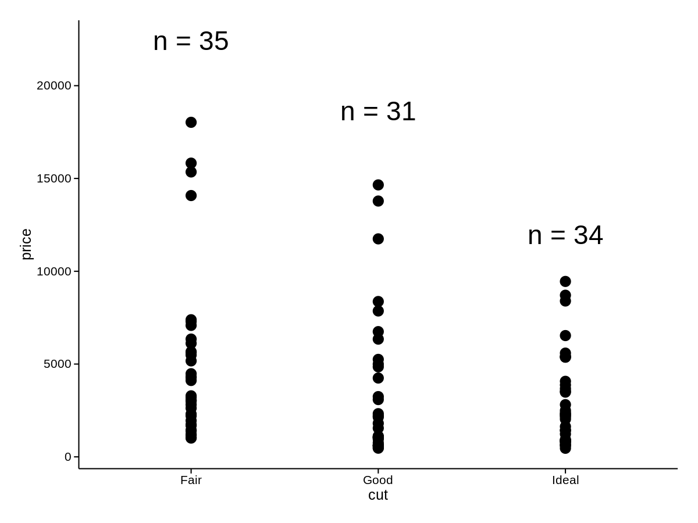

A new `Stat` class to add custom function labels on a plot

``` r
lab_func <- function(x) {
  str_glue("mean = {round(mean(x))}\nn = {length(x)}")
}

mini_diamond %>% ggplot(aes(y = cut, x = price)) +
  geom_point() +
  geom_text(aes(label = price),
    stat = "funcPL",
    lab_func = lab_func, lab_pos = 25000
  ) +
  xlim(0, 30000)
```

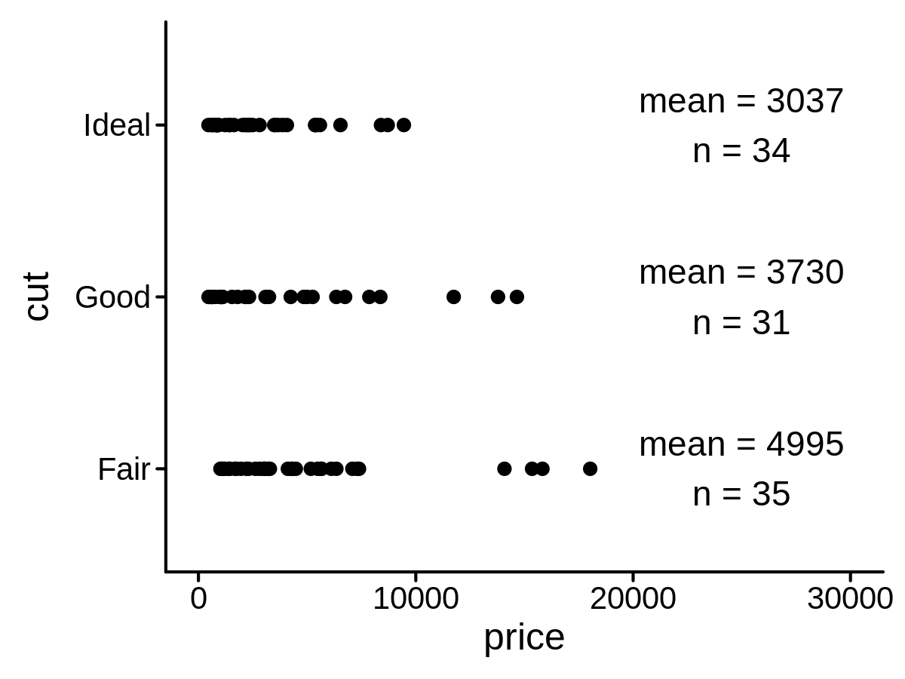

A new `Position` function to create float x/y position

``` r
mini_diamond %>% ggplot(aes(x = clarity, y = price)) +
  geom_point() +
  geom_text(aes(label = price),
    stat = "countPL",
    lab_pos = 20000, position = position_floatyPL()
  )
```

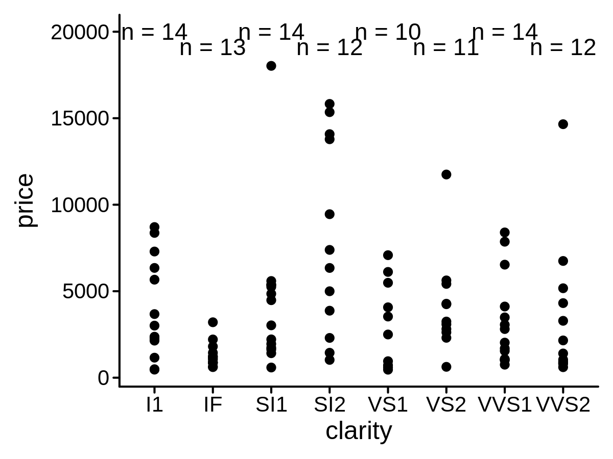

A variant of `scale_y_log10()` to show axis minor breaks and better axis
labels

``` r
mini_diamond %>% ggplot(aes(x = cut, y = price)) +
  geom_point() +
  geom_text(stat = "meanPL", lab_pos = 30000) +
  scale_y_log10_pl(show_minor_breaks = TRUE, limits = c(100, 100000))
```

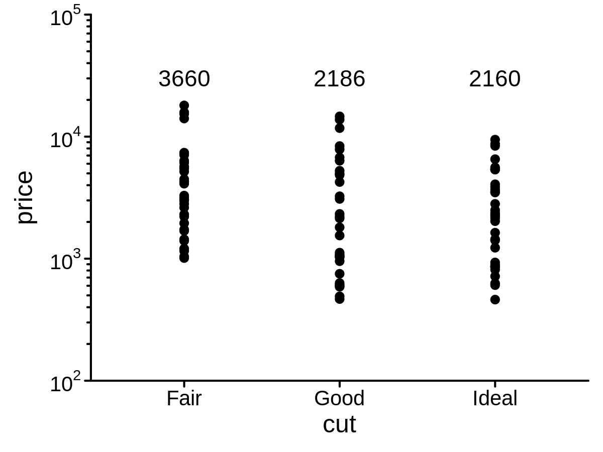

A variant of `scale_y_continuous()` to show axis minor breaks

``` r
mini_diamond %>% ggplot(aes(x = cut, y = price)) +
  geom_point() +
  geom_text(stat = "meanPL", lab_pos = 25000) +
  scale_y_continuous_pl(limits = c(0, 40000), minor_break_step = 2500)
```

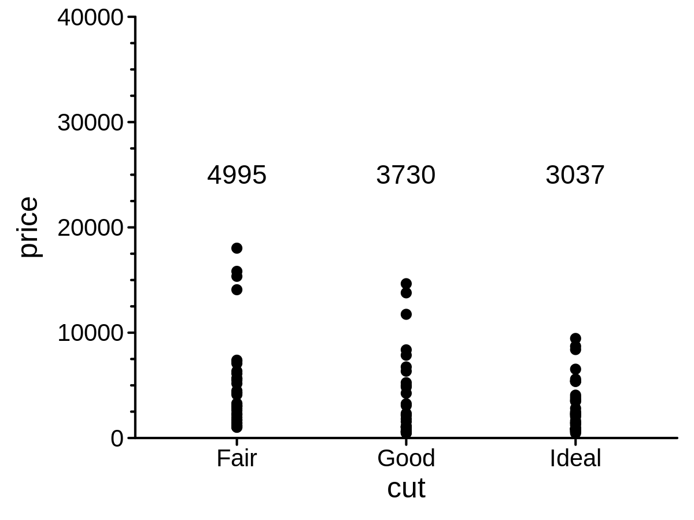

## color

- generate gradient colors

``` r
gradient_colors(c("blue", "red"), 10)
#>  [1] "#0000FF" "#1C00E2" "#3800C6" "#5500AA" "#71008D" "#8D0071" "#AA0055"
#>  [8] "#C60038" "#E2001C" "#FF0000"
```

- show colors

``` r
plot_colors(gradient_colors(c("blue", "red"), 10))
```

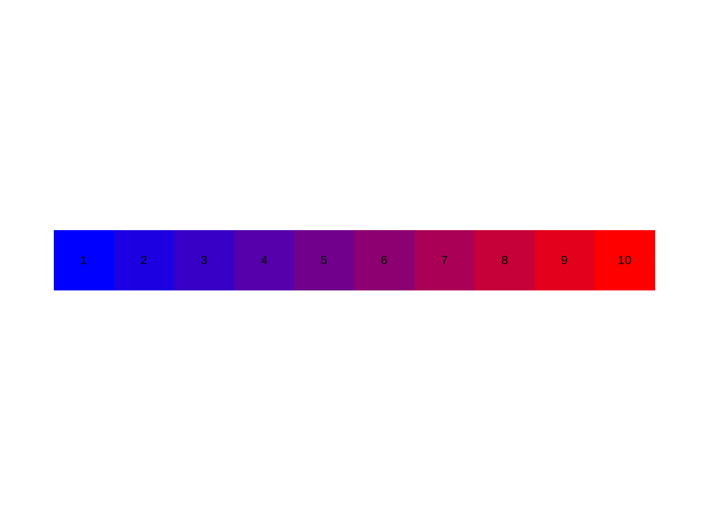

- select colors from `RColorBrewer` package presets

``` r
brewer_colors("Blues", 5) %>% plot_colors()
```


- select colors from `ggsci` package presets

``` r
sci_colors("npg", 5) %>% plot_colors()
```


- assign colors by a column in a tibble, for the convenience to use
  `scale_color_identity()`

``` r
assign_colors(mini_diamond, cut, colors = sci_colors("nejm", 8))
#> # A tibble: 100 × 8
#>    id    carat cut   clarity price     x     y assigned_colors
#>    <chr> <dbl> <chr> <chr>   <int> <dbl> <dbl> <chr>          
#>  1 id-1   1.02 Fair  SI1      3027  6.25  6.18 #BC3C29FF      
#>  2 id-2   1.51 Good  VS2     11746  7.27  7.18 #0072B5FF      
#>  3 id-3   0.52 Ideal VVS1     2029  5.15  5.18 #E18727FF      
#>  4 id-4   1.54 Ideal SI2      9452  7.43  7.45 #E18727FF      
#>  5 id-5   0.72 Ideal VS1      2498  5.73  5.77 #E18727FF      
#>  6 id-6   2.02 Fair  SI2     14080  8.33  8.37 #BC3C29FF      
#>  7 id-7   0.27 Good  VVS1      752  4.1   4.07 #0072B5FF      
#>  8 id-8   0.51 Good  SI2      1029  5.05  5.08 #0072B5FF      
#>  9 id-9   1.01 Ideal SI1      5590  6.43  6.4  #E18727FF      
#> 10 id-10  0.7  Fair  VVS1     1691  5.56  5.41 #BC3C29FF      
#> # … with 90 more rows
```

- colors of nucleotides and amino acids

``` r
# bioletter_colors
```

## theme

- a custom flexible theme

``` r
ggplot(mini_diamond, aes(x = x, y = y, color = clarity)) +
  geom_point(size = 2) +
  facet_grid(. ~ cut) +
  labs(title = "title", tag = "tag", caption = "caption") +
  theme_pl()
```

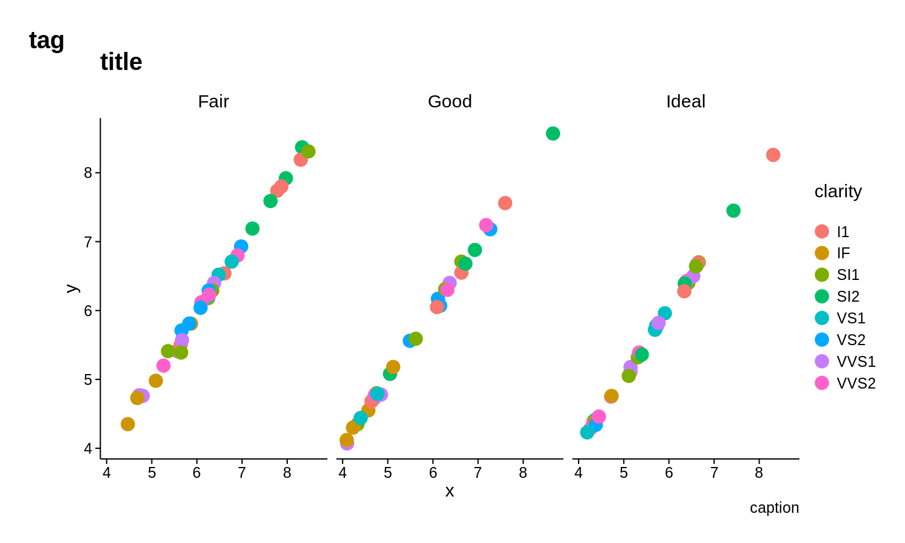

- a blank theme

``` r
ggplot(mini_diamond, aes(x = x, y = y, color = clarity)) +
  geom_point(size = 2) +
  facet_grid(. ~ cut) +
  labs(title = "title", tag = "tag", caption = "caption") +
  theme_pl0()
```

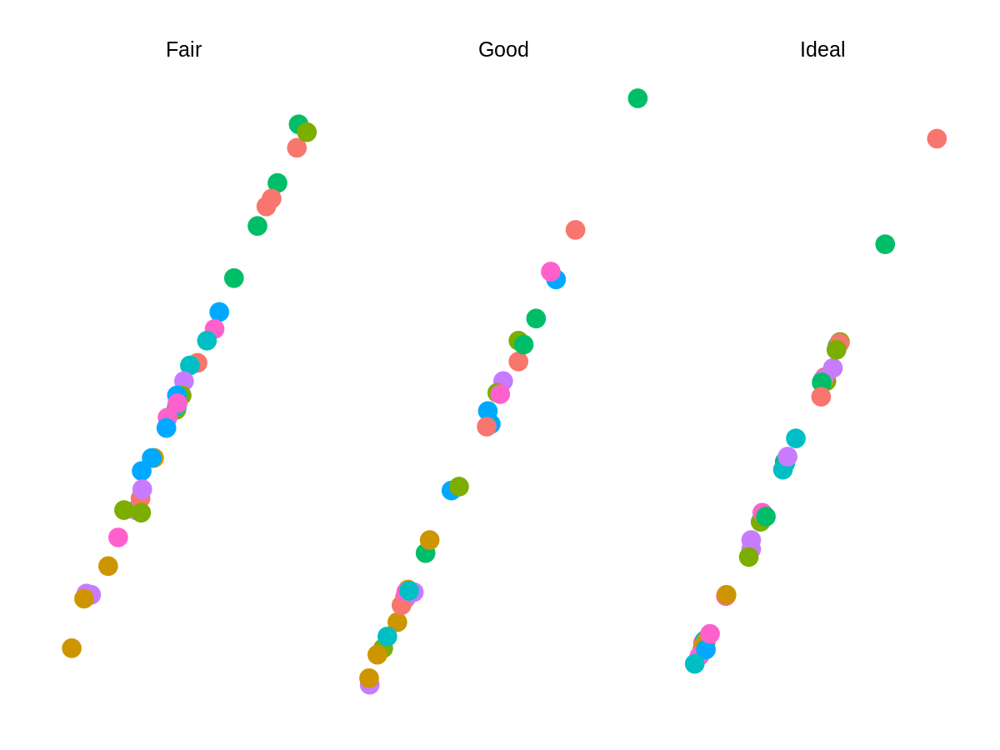

- a fixed mapping from size in `geom_xxx` to unit `pt` under 300 dpi

``` r
# for text and points
# geom_point(..., size = ppt(5))
# geom_text(..., size = tpt(5))

# for lines
# geom_line(..., linewidth = lpt(1))
```

- set repr size and resolution

``` r
pl_size(w = 4, h = 3, res = 300)
```

- units transformation

``` r
# inches <-> centimeters
inch2cm(1)
#> [1] 2.54
#> attr(,"unit")
#> [1] 1
in2cm(1)
#> [1] 2.54
#> attr(,"unit")
#> [1] 1
cm2inch(1)
#> [1] 0.3937008
#> attr(,"unit")
#> [1] 2
cm2in(1)
#> [1] 0.3937008
#> attr(,"unit")
#> [1] 2

# inches <-> millimeters
inch2mm(1)
#> [1] 25.4
#> attr(,"unit")
#> [1] 7
in2mm(1)
#> [1] 25.4
#> attr(,"unit")
#> [1] 7
mm2inch(1)
#> [1] 0.03937008
#> attr(,"unit")
#> [1] 2
mm2in(1)
#> [1] 0.03937008
#> attr(,"unit")
#> [1] 2

# points <-> centimeters
pt2cm(1)
#> [1] 0.03514598
#> attr(,"unit")
#> [1] 1
cm2pt(1)
#> [1] 28.45276
#> attr(,"unit")
#> [1] 8

# points <-> millimeters
pt2mm(1)
#> [1] 0.3514598
#> attr(,"unit")
#> [1] 7
mm2pt(1)
#> [1] 2.845276
#> attr(,"unit")
#> [1] 8
```

## IO

- save a plot

``` r
# pl_save(p, 'plot.pdf', width=14, height=10)
```

- save a plot into an blank A4 canvas, or a custom canvas

``` r
# pl_save(p, 'plot.pdf', width=14, height=10, canvas='A4', units='cm')

# pl_save(p, 'plot.pdf', width=14, height=10, canvas=c(20, 25), units='cm')
```
